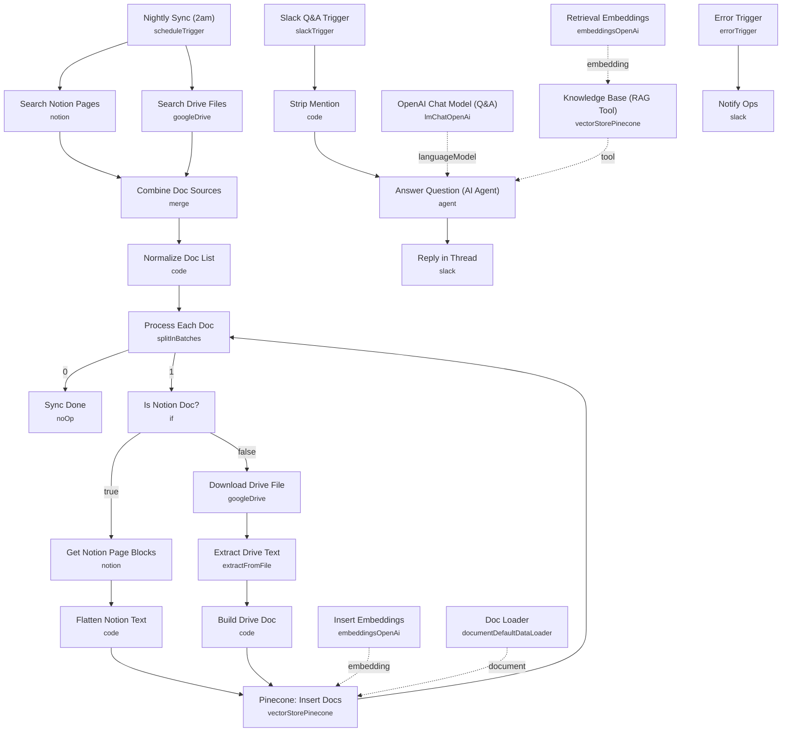

# RAG-Powered Internal Knowledge Chatbot

> Standalone reference build, pulled out of my [73-workflow n8n portfolio](https://github.com/Redsf/n8n-workflows). Credential-free — no secrets, API keys, or client data included.
>
> Full write-up (strategy, architecture, results) in the case study: [Redsf/internal-knowledge-chatbot-fintech →](https://github.com/Redsf/Redsf/blob/main/case-studies/internal-knowledge-chatbot-fintech.md)

A Slack-native Q&A bot that answers employee questions from your company's internal documentation. Notion pages and Google Drive files are synced into a Pinecone vector store every night, and mentioning the bot in Slack triggers an AI agent that retrieves the relevant chunks and replies in-thread with a source link attached.

Built for internal ops and knowledge-management teams that want documentation to stay searchable and current without anyone manually re-indexing it.

## Production results

From the production deployment of this architecture (fintech, internal ops):

| Metric | Result |
|---|---|
| New-hire onboarding time | **−50%** |
| Answers cited to source doc | **100%** (or honest "not found") |
| Index freshness | Nightly re-sync, zero manual work |

Full breakdown: [case study →](https://github.com/Redsf/Redsf/blob/main/case-studies/internal-knowledge-chatbot-fintech.md)

## Demo

<!-- SCREENSHOT: n8n canvas of this workflow — save as docs/images/workflow-canvas.png and uncomment -->
<!--  -->

<!-- SCREENSHOT: bot answering in a Slack thread with source link — save as docs/images/slack-answer.png and uncomment -->
<!--  -->

🎥 *Video walkthrough coming soon — question asked in Slack, source-cited answer back in thread.*

## What it does

This workflow runs two independent flows off two triggers.

**Nightly index sync:**

1. **Nightly Sync (2am)** fires once a day.
2. **Search Notion Pages** and **Search Drive Files** run in parallel, pulling the full page/file list from each source.
3. **Combine Doc Sources** merges both lists into one stream.
4. **Normalize Doc List** (Code node) reshapes every item into a common `{id, title, url, source}` structure.
5. **Process Each Doc** loops through the documents one at a time (batch size 1).
6. **Is Notion Doc?** branches on the `source` field:
   - Notion path: **Get Notion Page Blocks** fetches the page's blocks, then **Flatten Notion Text** joins the block text into a single content string.
   - Drive path: **Download Drive File** downloads the binary, **Extract Drive Text** pulls plain text out of it, then **Build Drive Doc** assembles the same `{id, title, url, source, content}` shape.
7. **Pinecone: Insert Docs** upserts each document into Pinecone, embedding it via **Insert Embeddings** and chunking/loading it through **Doc Loader**, which attaches title, url, and source as metadata.
8. The loop feeds back into **Process Each Doc** until every document is processed, then falls through to **Sync Done**.

**Slack Q&A:**

1. **Slack Q&A Trigger** fires on an `app_mention` event in the configured channel.
2. **Strip Mention** (Code node) removes the `<@BOTID>` tag from the message text and captures the channel and thread timestamp.
3. **Answer Question (AI Agent)** answers the question using **OpenAI Chat Model (Q&A)** and the **Knowledge Base (RAG Tool)**, a Pinecone retrieval tool (top 4 matches, with document metadata included) backed by **Retrieval Embeddings**. The agent's system prompt requires it to cite the source URL from the retrieved metadata, or say honestly that nothing relevant was found.
4. **Reply in Thread** posts the agent's answer back to Slack as a threaded reply.

**Error handling:** a separate **Error Trigger** catches any failure across the workflow and **Notify Ops** posts the failing error message to a Slack ops-alerts channel.

## Setup (about 25 minutes)

1. **Notion** — connect your account in **Search Notion Pages** and **Get Notion Page Blocks**.
2. **Google Drive** — connect your account in **Search Drive Files** and **Download Drive File**.
3. **OpenAI** — add your key in **Insert Embeddings**, **Retrieval Embeddings**, and **OpenAI Chat Model (Q&A)** (uses `text-embedding-3-small` for embeddings and `gpt-5-mini` for chat).
4. **Pinecone** — connect your account in **Pinecone: Insert Docs** and **Knowledge Base (RAG Tool)**, and set your actual index name in both nodes (replace the `REPLACE_WITH_PINECONE_INDEX` placeholder).
5. **Slack** — connect your account in **Slack Q&A Trigger**, **Reply in Thread**, and **Notify Ops**. Enable the `app_mention` event on your Slack app, set the target channel ID in **Slack Q&A Trigger** (replace `REPLACE_WITH_CHANNEL_ID`), and set the ops-alerts channel in **Notify Ops**.

All credential IDs in this workflow are placeholders (`REPLACE_WITH_CREDENTIAL_ID`) — assign your own n8n credentials to each node before activating.

## Error handling

Notion and Drive API calls retry up to twice on failure. A dedicated **Error Trigger** catches any workflow-level failure and **Notify Ops** posts the error message to a Slack channel, so a broken nightly sync or a failed Slack reply doesn't go unnoticed.

---

<!-- ARCHITECTURE:START -->
## Architecture

<!-- ARCHITECTURE:END -->
